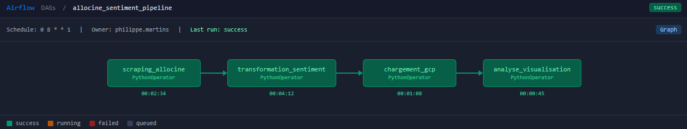
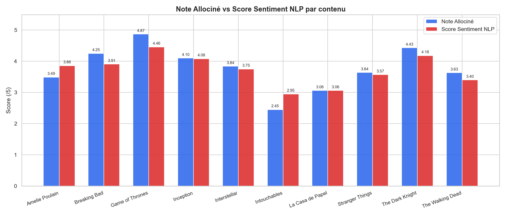
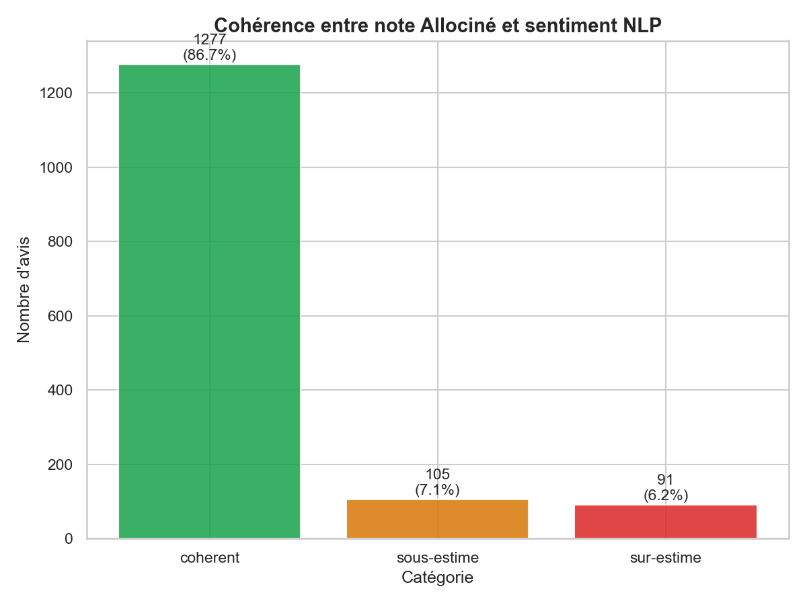
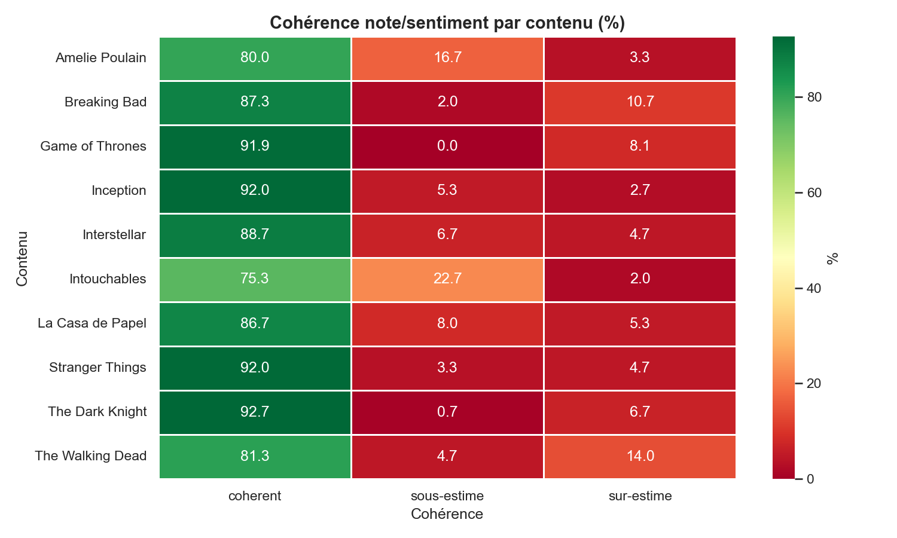

# 🎬 Sentiment Allociné Pipeline

> **Scraping · NLP · GCP Cloud Storage · BigQuery · Airflow · Streamlit**


---

## 🇫🇷 Présentation du projet

Ce projet implémente un **pipeline ETL de bout en bout** combinant scraping web, analyse de sentiment NLP et infrastructure cloud, inspiré de mon travail chez **Bouygues Telecom** (pôle Big Data) sur l'analyse de la perception client.

L'objectif : scraper les avis spectateurs d'Allociné sur 10 films et séries populaires, analyser automatiquement le sentiment des textes avec un modèle NLP multilingue, et **croiser ce score avec la note donnée par l'utilisateur** pour détecter les incohérences — un insight impossible à obtenir avec la note seule.

> Ce projet est le 3ème d'un portfolio data progressif : CSV → données simulées → scraping web + cloud.

### Ce que ce projet démontre

- Scraping de pages JavaScript dynamiques avec **Selenium + BeautifulSoup**
- Analyse de sentiment NLP avec **HuggingFace Transformers** (modèle multilingue)
- Stockage cloud sur **GCP Cloud Storage** et **BigQuery**
- Orchestration du pipeline avec **Apache Airflow** (DAG)
- Dashboard interactif connecté à **BigQuery** en temps réel (Streamlit)
- Détection d'incohérences note/sentiment : insight métier original

---

## 🇬🇧 Project Overview

This project implements an **end-to-end ETL pipeline** combining web scraping, NLP sentiment analysis, and cloud infrastructure, inspired by my apprenticeship at **Bouygues Telecom** (Big Data division) analyzing customer perception.

The goal: scrape Allociné viewer reviews for 10 popular films and series, automatically analyze text sentiment using a multilingual NLP model, and **cross-reference this score with the user's rating** to detect inconsistencies — an insight impossible to obtain from ratings alone.

### What this project demonstrates

- Dynamic JavaScript page scraping with **Selenium + BeautifulSoup**
- NLP sentiment analysis with **HuggingFace Transformers** (multilingual model)
- Cloud storage on **GCP Cloud Storage** and **BigQuery**
- Pipeline orchestration with **Apache Airflow** (DAG)
- Interactive dashboard connected to **BigQuery** in real time (Streamlit)
- Note/sentiment inconsistency detection: original business insight

---

## 🗂️ Project Structure
```
projet-sentiment-allocine/
│
├── dags/
│   └── allocine_pipeline.py        # DAG Airflow (orchestration)
│
├── src/
│   ├── __init__.py
│   ├── scraper.py                  # Scraping Allociné (Selenium)
│   ├── transform.py                # Nettoyage + Sentiment NLP
│   ├── gcp.py                      # Upload GCS + BigQuery
│   └── analyze.py                  # Visualisations
│
├── data/
│   ├── raw/                        # Avis bruts scrappés (CSV)
│   └── processed/                  # Avis enrichis (CSV)
│
├── outputs/                        # Graphiques générés (PNG)
│   ├── note_vs_sentiment.png
│   ├── coherence_note_sentiment.png
│   ├── distribution_notes.png
│   ├── sentiment_par_contenu.png
│   └── heatmap_coherence.png
│
├── notebooks/                      # Notebooks exploratoires
├── app.py                          # Dashboard Streamlit
├── main.py                         # Point d'entrée du pipeline
├── requirements.txt
└── README.md
```

---

## ⚙️ Pipeline Architecture
```
[ SCRAPING ] ── scraper.py
  Selenium + BeautifulSoup
  10 films & séries · ~1500 avis · Allociné
        │
        ▼
[ TRANSFORM ] ── transform.py
  • Nettoyage & normalisation des dates
  • Sentiment Analysis NLP (HuggingFace)
  • Score cohérence note / sentiment
        │
        ▼
[ GCP ] ──────── gcp.py
  • Upload CSV → Cloud Storage
  • Chargement → BigQuery
        │
        ▼
[ ANALYZE ] ───── analyze.py
  5 visualisations → outputs/
        │
        ▼
[ AIRFLOW ] ───── dags/allocine_pipeline.py
  DAG · Schedule : lundi 8h00
        │
        ▼
[ DASHBOARD ] ─── app.py
  Streamlit · BigQuery live · Filtres dynamiques
```
### DAG Airflow


---

## 📊 Résultats clés / Key Results

| Contenu | Note Allociné | Sentiment NLP | Cohérence |
|---------|--------------|---------------|-----------|
| Game of Thrones | ~4.2 | 4.46 | ✅ Cohérent |
| The Dark Knight | ~4.3 | 4.18 | ✅ Cohérent |
| Inception | ~4.1 | 4.08 | ✅ Cohérent |
| Intouchables | ~4.4 | 2.95 | ⚠️ Écart détecté |
| La Casa de Papel | ~3.8 | 3.06 | ⚠️ Écart détecté |

> **Insight clé** : 87% des avis sont cohérents entre note et sentiment. Les 13% restants révèlent des comportements intéressants — des utilisateurs qui sur-notent ou sous-notent par rapport à ce qu'ils écrivent réellement.

---

## 🤖 Modèle NLP

| Paramètre | Valeur |
|-----------|--------|
| **Modèle** | `nlptown/bert-base-multilingual-uncased-sentiment` |
| **Source** | HuggingFace Transformers |
| **Langues** | Multilingue (FR, EN, DE, ES, IT, NL) |
| **Output** | Score 1 à 5 étoiles + confidence |
| **Avis analysés** | ~1 500 |

---

## ☁️ Infrastructure GCP

| Service | Usage |
|---------|-------|
| **Cloud Storage** | Stockage des CSV bruts et enrichis |
| **BigQuery** | Entrepôt de données + requêtes analytiques |
| **gcloud CLI** | Authentification via Application Default Credentials |

---

## 📈 Visualisations

### Note Allociné vs Score Sentiment NLP


### Cohérence note / sentiment


### Heatmap cohérence par contenu


---

## 🚀 Installation & Usage

### Prérequis / Prerequisites
- Python 3.9+
- Google Chrome installé
- Compte GCP avec Cloud Storage + BigQuery activés
- `gcloud` CLI configuré (`gcloud auth application-default login`)

### Setup
```bash
# Cloner le dépôt
git clone https://github.com/PhilippeMARTINS/projet-sentiment-allocine.git
cd projet-sentiment-allocine

# Environnement virtuel
python -m venv venv
venv\Scripts\activate      # Windows
source venv/bin/activate   # Mac/Linux

# Dépendances
pip install -r requirements.txt
```

### Lancer le pipeline complet
```bash
python main.py
```

### Lancer le dashboard
```bash
streamlit run app.py
```

---

## 🛠️ Tech Stack

| Outil | Usage |
|-------|-------|
| **Python 3.9** | Langage principal |
| **Selenium** | Scraping pages JavaScript |
| **BeautifulSoup4** | Parsing HTML |
| **HuggingFace Transformers** | Modèle NLP sentiment |
| **GCP Cloud Storage** | Stockage fichiers cloud |
| **BigQuery** | Entrepôt de données |
| **Apache Airflow** | Orchestration DAG |
| **Pandas** | Manipulation des données |
| **Matplotlib / Seaborn** | Visualisations |
| **Streamlit** | Dashboard interactif |

---

## 👤 Auteur / Author

**Philippe Morais Martins** — Data Engineer / Scientist  
M2 Data Engineering · Paris Ynov Campus  
Anglais courant · Portugais bilingue

📧 philippe.martins@hotmail.com  
🔗 [LinkedIn](https://linkedin.com/in/) ← *(à compléter)*  
💻 [GitHub](https://github.com/PhilippeMARTINS)