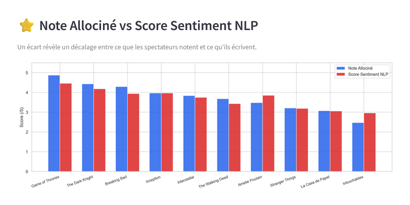
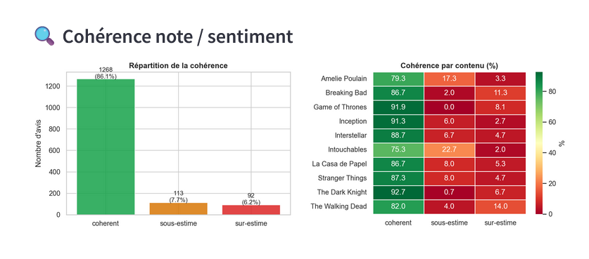
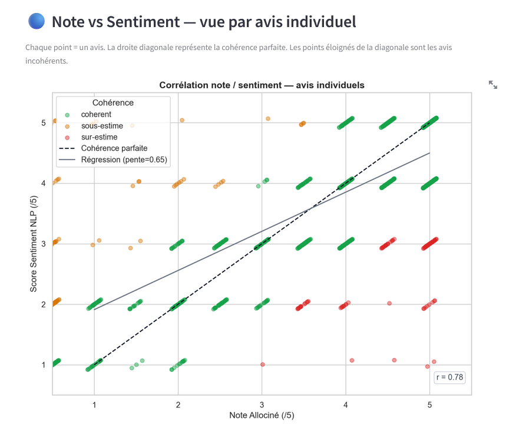

# 🎬 Sentiment Allociné Pipeline

> **Scraping · NLP · GCP Cloud Storage · BigQuery · Airflow · Streamlit**


---

## 🇫🇷 Présentation du projet

Ce projet implémente un **pipeline ETL de bout en bout** combinant scraping web, analyse de sentiment NLP et infrastructure cloud, inspiré de mon travail chez **Bouygues Telecom** (pôle Big Data) sur l'analyse de la perception client.

L'objectif : scraper les avis spectateurs d'Allociné sur 10 films et séries populaires, analyser automatiquement le sentiment des textes avec un modèle NLP multilingue, et **croiser ce score avec la note donnée par l'utilisateur** pour détecter les incohérences — un insight impossible à obtenir avec la note seule.

> Ce projet est le 3ème d'un portfolio data progressif : CSV → données simulées → scraping web + cloud.

### Ce que ce projet démontre

- Scraping de pages JavaScript dynamiques avec **Selenium + BeautifulSoup**
- Analyse de sentiment NLP avec **HuggingFace Transformers** (modèle multilingue BERT)
- Stockage cloud sur **GCP Cloud Storage** et **BigQuery**
- Orchestration du pipeline avec **Apache Airflow** (DAG hebdomadaire)
- Dashboard interactif connecté à **BigQuery** en temps réel (Streamlit)
- Validation automatique de la qualité des données à chaque étape (`validate.py`)
- Détection d'incohérences note/sentiment : insight métier original
- Suite de tests unitaires (35 tests pytest) + CI/CD GitHub Actions

---

## 🇬🇧 Project Overview

This project implements an **end-to-end ETL pipeline** combining web scraping, NLP sentiment analysis, and cloud infrastructure, inspired by my apprenticeship at **Bouygues Telecom** (Big Data division) analyzing customer perception.

The goal: scrape Allociné viewer reviews for 10 popular films and series, automatically analyze text sentiment using a multilingual NLP model, and **cross-reference this score with the user's rating** to detect inconsistencies — an insight impossible to obtain from ratings alone.

### What this project demonstrates

- Dynamic JavaScript page scraping with **Selenium + BeautifulSoup**
- NLP sentiment analysis with **HuggingFace Transformers** (multilingual BERT model)
- Cloud storage on **GCP Cloud Storage** and **BigQuery**
- Pipeline orchestration with **Apache Airflow** (weekly DAG)
- Interactive dashboard connected to **BigQuery** in real time (Streamlit)
- Automatic data quality validation at each step (`validate.py`)
- Note/sentiment inconsistency detection: original business insight
- Unit test suite (35 pytest tests) + CI/CD GitHub Actions

---

## 🗂️ Project Structure

```
projet-sentiment-allocine/
│
├── src/
│   ├── scraper.py              # Scraping Allociné (Selenium + BeautifulSoup)
│   ├── transform.py            # Nettoyage + Sentiment NLP (HuggingFace)
│   ├── gcp.py                  # Upload GCS + chargement BigQuery
│   ├── analyze.py              # Visualisations statiques (PNG)
│   └── validate.py             # Validation qualité des données
│
├── tests/
│   ├── test_trasform.py        # 24 tests — parse_sentiment, coherence, clean_reviews
│   └── test_validate.py        # 11 tests — validate_raw_reviews, validate_clean_reviews
│
├── dags/
│   └── allocine_pipeline.py    # DAG Airflow — schedule lundi 8h00
│
├── data/
│   ├── raw/                    # Avis bruts scrappés (non commités)
│   └── processed/              # Avis enrichis avec scores NLP
│
├── outputs/                    # Graphiques statiques générés (PNG)
│
├── .github/
│   └── workflows/
│       └── tests.yml           # CI/CD GitHub Actions
│
├── app.py                      # Dashboard Streamlit (BigQuery live)
├── main.py                     # Point d'entrée du pipeline
├── Makefile                    # Commandes raccourcies
├── requirements.txt
├── .env.example
└── README.md
```

---

## ⚙️ Pipeline Architecture

```
[ SCRAPING ] ─── scraper.py
  Selenium + BeautifulSoup
  10 films & séries · ~1 500 avis · Allociné
        │
        ▼
[ VALIDATE ] ─── validate.py
  Vérification colonnes, notes, textes, nb contenus
        │
        ▼
[ TRANSFORM ] ── transform.py
  • Nettoyage & normalisation des dates
  • Analyse de sentiment NLP (HuggingFace BERT)
  • Score de cohérence note / sentiment
        │
        ▼
[ VALIDATE ] ─── validate.py
  Vérification sentiment_score, coherence, confidence
        │
        ▼
[ GCP ] ─────── gcp.py
  • Upload CSV → Cloud Storage
  • Chargement → BigQuery
        │
        ▼
[ ANALYZE ] ──── analyze.py
  5 visualisations statiques → outputs/
        │
        ▼
[ AIRFLOW ] ──── dags/allocine_pipeline.py
  DAG · Schedule : lundi 8h00
        │
        ▼
[ DASHBOARD ] ── app.py
  Streamlit · BigQuery live · Filtres dynamiques
```

---

## 🤖 Modèle NLP

| Paramètre | Valeur |
|-----------|--------|
| **Modèle** | `nlptown/bert-base-multilingual-uncased-sentiment` |
| **Source** | HuggingFace Hub |
| **Langues** | Multilingue (FR, EN, DE, ES, IT, NL) |
| **Output** | Score 1 à 5 étoiles + score de confiance |
| **Avis analysés** | ~1 500 |
| **Taux de cohérence** | 86% |

### Définition de la cohérence

Un avis est **cohérent** si l'écart entre la note Allociné et le score NLP est ≤ 1 point.

```python
def compute_coherence(note: float, sentiment_score: int) -> str:
    diff = abs(note - sentiment_score)
    if diff <= 1:   return "coherent"
    elif note > sentiment_score: return "sur-estime"
    else:           return "sous-estime"
```

---

## 📊 Résultats clés / Key Results

| Contenu | Note Allociné | Sentiment NLP | Cohérence |
|---------|--------------|---------------|-----------|
| Game of Thrones | ~4.2 | 4.46 | ✅ Cohérent |
| The Dark Knight | ~4.3 | 4.18 | ✅ Cohérent |
| Inception | ~4.1 | 3.97 | ✅ Cohérent |
| Intouchables | ~4.4 | 2.96 | ⚠️ Sur-estime |
| La Casa de Papel | ~3.8 | 3.06 | ⚠️ Sur-estime |

> **Insight clé** : 86% des avis sont cohérents entre note et sentiment.
> Les 14% restants révèlent des comportements intéressants — des utilisateurs
> qui sur-notent ou sous-notent par rapport à ce qu'ils écrivent réellement.

---

## 📊 Visualisations — Aperçu du dashboard

Le dashboard contient **9 graphiques** + une console BigQuery :

| # | Titre | Description |
|---|-------|-------------|
| 1 | ⭐ Note Allociné vs Score Sentiment NLP | Barres groupées note/sentiment par contenu |
| 2 | 🔍 Cohérence note / sentiment | Répartition + heatmap cohérence par contenu |
| 3 | 📊 Distribution des notes et sentiments | Histogrammes côte à côte |
| 4 | 🎬 Sentiment moyen par contenu | Barres horizontales colorées par type |
| 5 | 📝 Longueur des avis par label sentiment | Violin plot longueur vs sentiment |
| 6 | 📅 Évolution temporelle du sentiment | Courbe sentiment moyen dans le temps |
| 7 | 🎯 Score de confiance du modèle NLP | Distribution + confiance par label |
| 8 | 🔵 Note vs Sentiment — vue individuelle | Scatter plot avec droite de régression |
| — | 🧮 Requête BigQuery personnalisée | Console SQL sur la table BigQuery live |

### ⭐ Note Allociné vs Score Sentiment NLP
Le graphique central — écarts visibles sur Intouchables et La Casa de Papel.


### 🔍 Cohérence note / sentiment
86% d'avis cohérents — les incohérences révèlent des comportements de notation atypiques.


### 🔵 Note vs Sentiment — vue individuelle
Chaque point = un avis. Les points éloignés de la diagonale sont les avis incohérents.


---

## ☁️ Infrastructure GCP

| Service | Usage |
|---------|-------|
| **Cloud Storage** | Stockage des CSV bruts et enrichis |
| **BigQuery** | Entrepôt de données + requêtes analytiques |
| **gcloud CLI** | Authentification via Application Default Credentials |

---

## 🔄 Orchestration Airflow

Le DAG `allocine_pipeline` orchestre le pipeline complet chaque lundi à 8h00 :

```
scraping → transformation NLP → upload GCS → chargement BigQuery → analyse
```

---

## 🧪 Tests / Testing

```bash
python -m pytest tests/ -v
```

```
tests/test_trasform.py::TestParseSentimentLabel::test_un_star_retourne_1    PASSED
tests/test_trasform.py::TestComputeCoherence::test_coherent_si_ecart_faible PASSED
tests/test_validate.py::TestValidateRawReviews::test_dataframe_valide_passe  PASSED
tests/test_validate.py::TestValidateCleanReviews::test_doublons_echouent     PASSED
...
35 passed in 1.97s
```

---

## 🚀 Installation & Lancement / Getting Started

### Prérequis / Prerequisites
- Python 3.9+
- pip
- `make` — Windows : `winget install GnuWin32.Make` | Mac/Linux : déjà installé
- Google Chrome installé
- Compte GCP avec Cloud Storage + BigQuery activés
- `gcloud` CLI configuré : `gcloud auth application-default login`

### Étapes / Steps

```bash
# 1. Cloner le dépôt
git clone https://github.com/PhilippeMARTINS/projet-sentiment-allocine.git
cd projet-sentiment-allocine

# 2. Créer et activer l'environnement virtuel
python -m venv venv
venv\Scripts\activate        # Windows
# source venv/bin/activate   # Mac/Linux

# 3. Installer les dépendances
pip install -r requirements.txt

# 4. Configurer les variables d'environnement GCP
cp .env.example .env         # puis renseigner PROJECT_ID, BUCKET_NAME, etc.

# 5. Lancer le pipeline complet
python main.py

# 6. Lancer le dashboard
streamlit run app.py
```

### Commandes Makefile

```bash
make install    # Installe les dépendances
make run        # Lance le pipeline complet
make scrape     # Lance uniquement le scraping
make transform  # Lance uniquement la transformation NLP
make dashboard  # Lance le dashboard Streamlit
make test       # Lance les tests pytest
make clean      # Nettoie les fichiers temporaires
```

> ⚠️ Ne jamais copier le dossier `venv/` d'un PC à l'autre — toujours le recréer localement.
> L'installation de `torch` peut prendre plusieurs minutes selon la connexion.

---

## 🛠️ Tech Stack

| Outil | Usage |
|-------|-------|
| **Python 3.9** | Langage principal |
| **Selenium 4.x** | Scraping pages JavaScript dynamiques |
| **BeautifulSoup4** | Parsing HTML |
| **HuggingFace Transformers** | Modèle NLP sentiment (BERT multilingue) |
| **GCP Cloud Storage** | Stockage fichiers cloud |
| **BigQuery** | Entrepôt de données |
| **Apache Airflow** | Orchestration DAG |
| **Pandas** | Manipulation des données |
| **Matplotlib / Seaborn** | Visualisations statiques |
| **Streamlit** | Dashboard interactif |
| **python-dotenv** | Gestion des variables d'environnement |
| **pytest** | Tests unitaires |

---

## 👤 Auteur / Author

**Philippe Morais Martins** — Data Engineer / Scientist
M2 Data Engineering · Paris Ynov Campus
Anglais courant · Portugais bilingue

📧 philippe.martins@hotmail.com
🔗 [LinkedIn](https://www.linkedin.com/in/philippe-morais-martins/)
💻 [GitHub](https://github.com/PhilippeMARTINS)
